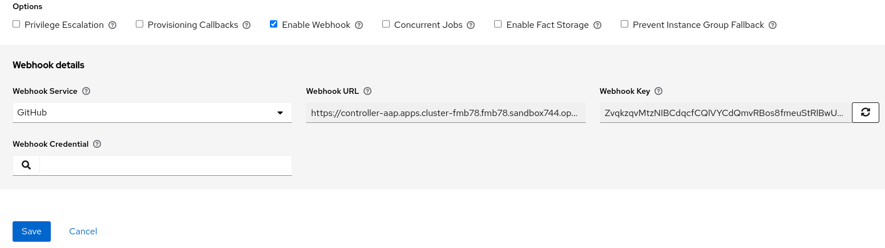
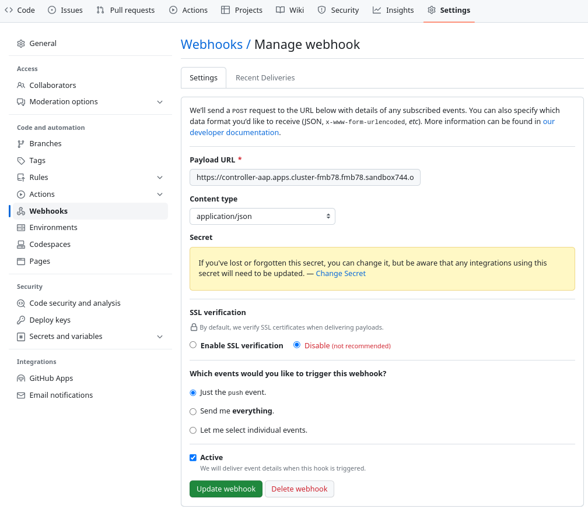

# Ansible-github-webhook

https://docs.ansible.com/automation-controller/latest/html/userguide/job_templates.html#ug-jt-enable-webhooks


## webhokk setting on Ansible Controller for "Hello World" job template

**Enable Webhook**: Turns on the ability to interface with a predefined SCM system web service that is used to launch a job template. Currently supported SCM systems are `GitHub` and `GitLab`.

You’ll land in the Master realm by default.


**Webhook URL**: Automatically populated with the URL for the webhook service to POST requests to, which is used in the Github webhook settings.
```
https://controller-aap.apps.cluster-fmb78.fmb78.sandbox744.opentlc.com/api/v2/job_templates/7/github/
```

**Webhook Key**: Generated shared secret to be used by the webhook service to sign payloads sent to automation controller. This must be configured in the settings on the webhook service in order for automation controller to accept webhooks from this service, which is used in the Github webhook settings.
```
ZvqkzqvMtzNIBCdqcfCQlVYCdQmvRBos8fmeuStRlBwUyrWojG
```


## webhokk setting on gitHub


You’ll land in the Master realm by default.


**Payload URL**
```
https://controller-aap.apps.cluster-fmb78.fmb78.sandbox744.opentlc.com/api/v2/job_templates/7/github/
```

**Content type**
```
application/json
```

**Secret**
```
ZvqkzqvMtzNIBCdqcfCQlVYCdQmvRBos8fmeuStRlBwUyrWojG
```

